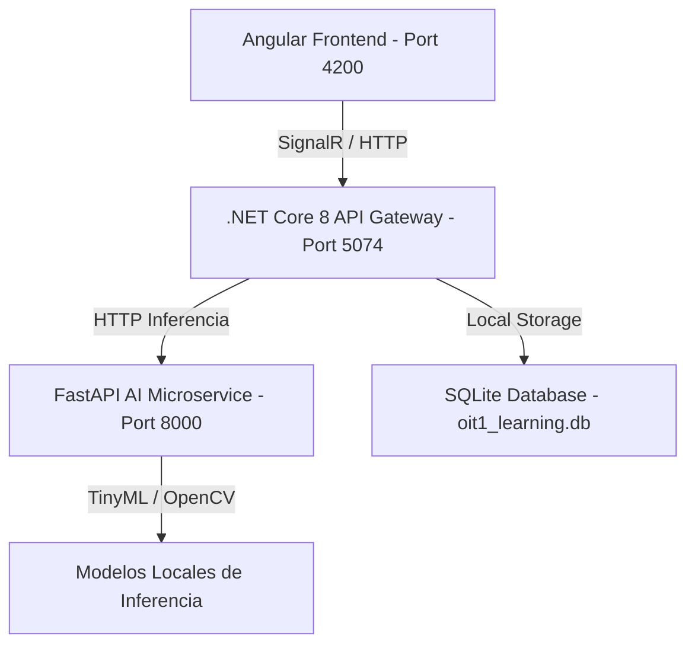

# OIT 1 - Smart Learning Platform

Plataforma de aprendizaje interactiva diseñada para la preparación avanzada y estudio de la materia **Operaciones e Infraestructura Tecnológica (OIT 1)**. El sistema integra visualizaciones en tiempo real, simulaciones de auditoría de red (Nmap) y un temario interactivo con rigor matemático y analogías prácticas preparadas para sustentaciones de tesis a nivel experto.

---

## 🛠️ Arquitectura del Sistema

El proyecto está diseñado bajo una arquitectura de microservicios desacoplada y orientada a eventos en tiempo real:



1. **Frontend (Angular 17)**: Interfaz responsiva y dinámica con soporte para visualizaciones métricas, visor de diagramas (Lightbox) y consola interactiva de puertos de red.
2. **Backend (.NET Core 8.0)**: API Gateway de alto rendimiento que maneja las conexiones en tiempo real vía **SignalR Hubs**, la persistencia relacional con **Entity Framework Core** y la orquestación de servicios.
3. **Base de Datos Autocontenida (SQLite)**: Base de datos ligera e independiente integrada directamente en el backend, ideal para despliegues locales ágiles sin dependencias de servidores de base de datos externos.
4. **FastAPI AI Microservice (Python 3.13)**: Microservicio científico encargado de procesar señales físicas (SciPy), procesar imágenes en tiempo real (OpenCV Haar Cascades) y realizar inferencias compactas (TensorFlow Lite / TinyML).

---

## ✨ Características Principales

* **Dashboard de Métricas en Tiempo Real**: Visualización dinámica de uso de CPU, RAM y telemetría simulada de sensores de humedad/temperatura IoT conectados a través de SignalR.
* **Temario Académico de Nivel Experto**: Mapeo exhaustivo de 8 tópicos de OIT 1 enriquecidos con fórmulas matemáticas y leyes físicas (notación Dirac, Born, ley de Snell, ángulo crítico, teorema CAP/PACELC, integral de Haar, SIMD, etc.).
* **Glosario de Analogías**: Cada término complejo del temario se explica mediante analogías cotidianas para facilitar su retención y comprensión lógica (relacionar conceptos abstractos con elementos del día a día).
* **Guía de Puertos y Simulador Nmap**: Directorio interactivo de puertos por defecto (TCP/UDP) con explicaciones ilustradas y un simulador interactivo de consola Nmap (escaneos `-sS`, `-sU`, `-A`).

---

## 🚀 Requisitos Previos

Asegúrate de tener instalados los siguientes componentes en tu sistema operativo (Windows):

* **.NET 8.0 SDK** o superior.
* **Node.js** (versión 18.x o superior) junto con `npm`.
* **Python** (versión 3.10 o superior) con soporte para pip.

---

## 💻 Instrucciones de Instalación y Ejecución

La plataforma cuenta con scripts de PowerShell automatizados en la raíz para agilizar el arranque local:

### 1. Iniciar toda la plataforma
Ejecuta la consola de PowerShell como Administrador en la raíz del proyecto y corre el orquestador principal:
```powershell
powershell -ExecutionPolicy Bypass -File .\run-platform.ps1
```
Este script restaurará las dependencias (npm, paquetes de NuGet, librerías de Python en un entorno virtual `.venv`), compilará los módulos e iniciará los tres servicios en paralelo.

### 2. Acceder al sistema
Una vez que el compilador de Angular complete el empaquetado, abre tu navegador e ingresa a:
* **Frontend**: `http://localhost:4200`
* **Directorio de Puertos e Nmap**: `http://localhost:4200/ports`
* **API Gateway Swagger (.NET)**: `http://localhost:5074/swagger`
* **AI FastAPI Swagger (Python)**: `http://localhost:8000/docs`

---

## 📂 Estructura del Proyecto

```directory
learning-platform-PIPD/
├── backend/                  # Código fuente de la API Gateway en .NET Core 8.0
│   ├── Controllers/          # Controladores HTTP REST
│   ├── Hubs/                 # SignalR Hubs para comunicación en tiempo real
│   ├── Services/             # Lógica de negocio y contexto de base de datos
│   ├── appsettings.json      # Configuración de base de datos SQLite y conexiones
│   └── Program.cs            # Registro de servicios e inicialización del API Host
├── frontend/                 # Aplicación SPA interactiva en Angular 17
│   ├── src/
│   │   ├── app/
│   │   │   ├── components/   # Vistas principales (Dashboard, PortsReference, etc.)
│   │   │   └── services/     # Clientes de APIs HTTP y SignalR
│   │   └── assets/           # Imágenes y diagramas de arquitectura purificados
│   └── angular.json          # Configuración del compilador de Angular y Vite
├── python-microservice/      # Inferencia de IA y procesamiento matemático en FastAPI
│   ├── app/
│   │   └── main.py           # Endpoints de visión artificial y análisis espectral (FFT)
│   ├── requirements.txt      # Dependencias de Python (TensorFlow, SciPy, OpenCV, Pandas)
│   └── Dockerfile            # Configuración de contenedorización Docker
└── run-platform.ps1          # Script de PowerShell de arranque global
```

---

## 🔒 Buenas Prácticas y Seguridad Aplicadas (Pre-Push)

Antes de realizar el commit y subir el código a GitHub, se aplicaron las siguientes buenas prácticas de desarrollo:

1. **Gestión de Archivos Ignorados (.gitignore)**: Configurado el archivo `.gitignore` raíz para omitir las carpetas de compilación (`dist/`, `.angular/`), binarios de .NET (`bin/`, `obj/`), dependencias de Node (`node_modules/`), entornos virtuales de Python (`.venv/`, `__pycache__/`) y bases de datos locales (`*.db`, `oit1_learning.db`) para evitar conflictos de ramas.
2. **Cero Credenciales en Código**: Migración de la conexión PostgreSQL con credenciales expuestas a un motor autónomo y seguro de **SQLite**, configurado dinámicamente desde el gestor de variables en `appsettings.json` sin llaves expuestas.
3. **Análisis de Compilación Limpio**: Todas las llamadas de APIs, interfaces, tipados y clases CSS compilan con un 100% de éxito en sus compiladores nativos (`ng build` y `dotnet build`).
