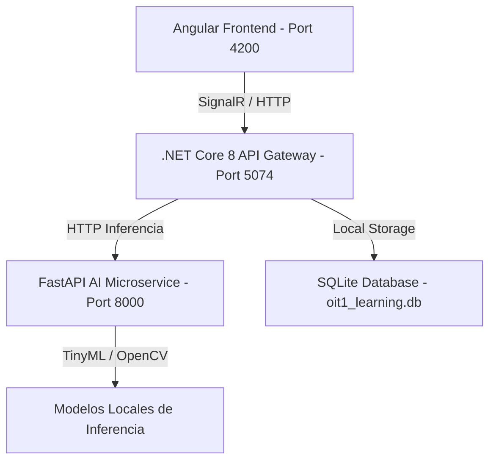

# OIT 1 - Smart Learning Platform

Plataforma de aprendizaje interactiva diseñada para la preparación avanzada y estudio de la materia **Operaciones e Infraestructura Tecnológica (OIT 1)**. El sistema integra visualizaciones en tiempo real, simulaciones de auditoría de red (Nmap) y un temario interactivo con rigor matemático y analogías prácticas preparadas para sustentaciones de tesis a nivel experto.

---

## 🛠️ Arquitectura del Sistema

El proyecto está diseñado bajo una arquitectura de microservicios desacoplada y orientada a eventos en tiempo real:



1. **Frontend (Angular 17)**: Interfaz responsiva y dinámica con soporte para visualizaciones métricas, visor de diagramas (Lightbox) y consola interactiva de puertos de red.
2. **Backend (.NET Core 8.0)**: API Gateway de alto rendimiento que maneja las conexiones en tiempo real vía **SignalR Hubs**, la persistencia relacional con **Entity Framework Core** y la orquestación de servicios.
3. **Base de Datos Autocontenida (SQLite)**: Base de datos ligera e independiente integrada directamente en el backend, ideal para despliegues locales ágiles sin dependencias de servidores de base de datos externos.
4. **FastAPI AI Microservice (Python 3.13)**: Microservicio científico encargado de procesar señales físicas (SciPy), procesar imágenes en tiempo real (OpenCV Haar Cascades) y realizar inferencias compactas (TensorFlow Lite / TinyML).

---

## ✨ Características Principales

* **Dashboard de Métricas en Tiempo Real**: Visualización dinámica de uso de CPU, RAM y telemetría simulada de sensores de humedad/temperatura IoT conectados a través de SignalR.
* **Temario Académico de Nivel Experto**: Mapeo exhaustivo de 8 tópicos de OIT 1 enriquecidos con fórmulas matemáticas y leyes físicas (notación Dirac, Born, ley de Snell, ángulo crítico, teorema CAP/PACELC, integral de Haar, SIMD, etc.).
* **Glosario de Analogías**: Cada término complejo del temario se explica mediante analogías cotidianas para facilitar su retención y comprensión lógica (relacionar conceptos abstractos con elementos del día a día).
* **Guía de Puertos y Simulador Nmap**: Directorio interactivo de puertos por defecto (TCP/UDP) con explicaciones ilustradas y un simulador interactivo de consola Nmap (escaneos `-sS`, `-sU`, `-A`).

---

## 🚀 Requisitos Previos

Asegúrate de tener instalados los siguientes componentes en tu sistema operativo (Windows):

* **.NET 8.0 SDK** o superior.
* **Node.js** (versión 18.x o superior) junto con `npm`.
* **Python** (versión 3.10 o superior) con soporte para pip.

---

## 🐳 Despliegue con Docker & Docker Compose

La plataforma cuenta con soporte nativo para **Docker** y **Docker Compose**, lo que permite desplegar todo el stack de microservicios con un solo comando en cualquier entorno Cloud o servidor local:

```bash
docker compose up --build -d
```

### Puertos Mapeados en Docker:
* **Frontend Angular**: `http://localhost:4200`
* **API Gateway .NET 8**: `http://localhost:5000` (Swagger en `/swagger`)
* **Microservicio Python (FastAPI)**: `http://localhost:8000` (Docs en `/docs`)
* **Base de Datos PostgreSQL**: `localhost:5432`
* **Caché Redis**: `localhost:6379`

---

## ⚡ Despliegue Automatizado (CI/CD con GitHub Actions)

El repositorio incluye una **GitHub Action** automatizada (`.github/workflows/deploy.yml`) que en cada push a la rama `main`:
1. Compila la aplicación Angular en modo producción con el base-href correspondiente.
2. Genera las copias necesarias para soporte SPA y enrutamiento 404.
3. Despliega automáticamente el frontend en **GitHub Pages**.

---

## 📚 Documentación y Reportes Incluidos

El repositorio incluye los compendios técnicos formales desarrollados durante la investigación:
* 📄 [GUIA_ESTUDIO_OIT1.md](GUIA_ESTUDIO_OIT1.md): Guía de estudio maestra universitaria de OIT 1.
* 📄 [INFORME_TECNICO_OIT1.md](INFORME_TECNICO_OIT1.md): Informe técnico completo sobre infraestructura cloud, contenedores, normas ISO y herramientas de benchmarking (`ab`, `iperf3`, GCP Deployment Manager).
* 📄 [Guia_Informacion_Clave_OIT1.docx](Guia_Informacion_Clave_OIT1.docx): Documento ejecutable de Microsoft Word con la síntesis objetiva de los contenidos de la carpeta `informacion`.

---

## 📂 Estructura del Proyecto

```directory
learning-platform-PIPD/
├── .github/workflows/        # Pipeline CI/CD automatizado para GitHub Pages
├── backend/                  # Código fuente de la API Gateway en .NET Core 8.0
│   ├── Controllers/          # Controladores HTTP REST
│   ├── Hubs/                 # SignalR Hubs para comunicación en tiempo real
│   ├── Services/             # Lógica de negocio y contexto de base de datos
│   ├── appsettings.json      # Configuración de base de datos y microservicios
│   └── Dockerfile            # Contenedorización del backend .NET
├── frontend/                 # Aplicación SPA interactiva en Angular 17
│   ├── src/
│   │   ├── app/
│   │   │   ├── components/   # Vistas (Dashboard, Syllabus, ExamPractice, PortsReference, etc.)
│   │   │   └── services/     # Clientes de APIs HTTP y SignalR WebSockets
│   │   └── assets/           # Imágenes y diagramas de arquitectura
│   └── Dockerfile            # Servidor Nginx para contenedorización de producción
├── python-microservice/      # Inferencia de IA y procesamiento matemático en FastAPI
│   ├── app/
│   │   └── main.py           # Endpoints de visión artificial (OpenCV) y análisis espectral (SciPy)
│   ├── requirements.txt      # Dependencias de Python (TensorFlow, SciPy, OpenCV, Pandas)
│   └── Dockerfile            # Contenedorización del microservicio Python
├── docker-compose.yml        # Orquestación completa de 5 contenedores (Frontend, Backend, Python, Postgres, Redis)
├── GUIA_ESTUDIO_OIT1.md      # Guía de estudio maestra
├── INFORME_TECNICO_OIT1.md   # Informe técnico formal
└── run-platform.ps1          # Script de PowerShell de arranque global
```

---

## 🔒 Buenas Prácticas y Auditoría del Repositorio

1. **Filtros de Exclusión Estrictos (`.gitignore`)**: Se han configurado reglas para excluir cualquier binario compilado (`bin/`, `obj/`, `dist/`), librerías (`node_modules/`, `.venv/`), archivos de sistema (`Thumbs.db`, `.DS_Store`), bases de datos locales (`*.db`) y la carpeta local de insumos `informacion/`.
2. **Despliegue y Pruebas de Compilación**: Todos los compiladores (Angular `ng build`, .NET `dotnet build`, Python FastAPI) compilan con un 100% de éxito en entorno de producción.
3. **Cero Secretos Expuestos**: Las cadenas de conexión en `docker-compose.yml` y `appsettings.json` utilizan valores seguros por defecto para entornos de desarrollo y variables de entorno sobreescribibles para producción.
